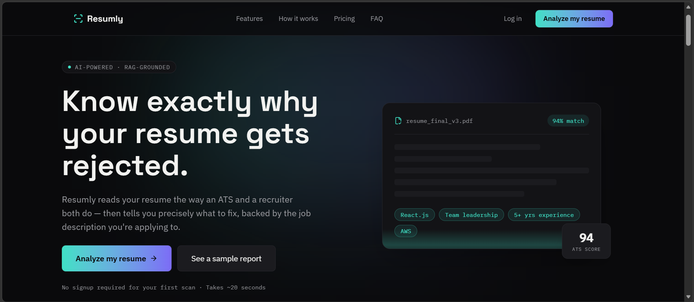
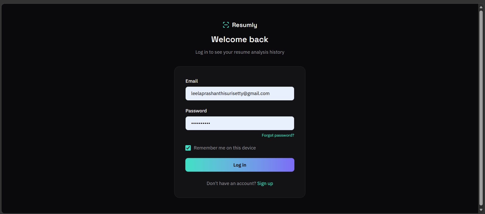
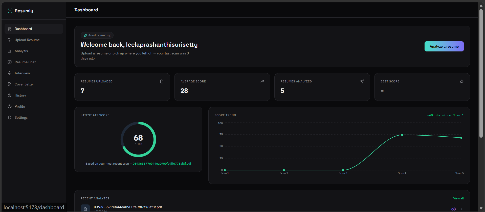
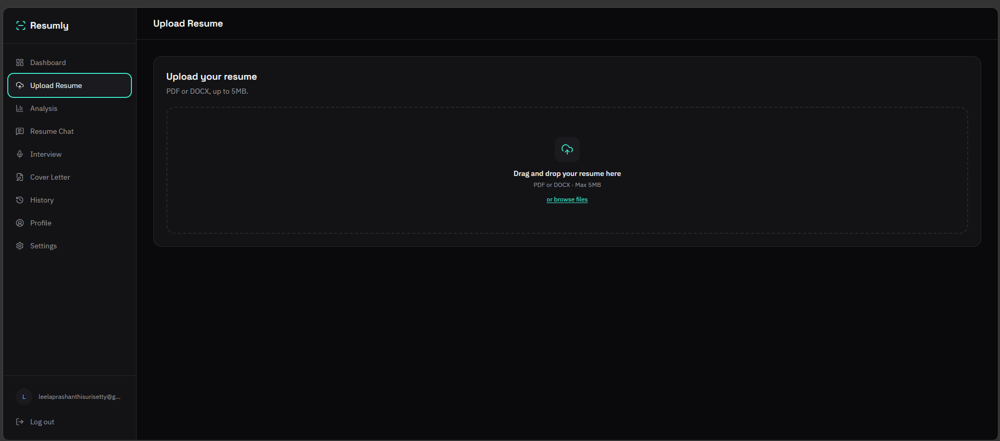
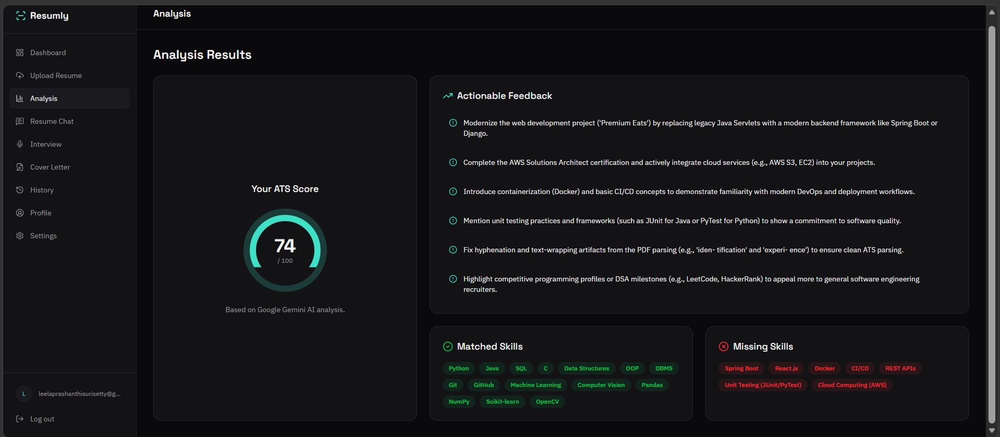
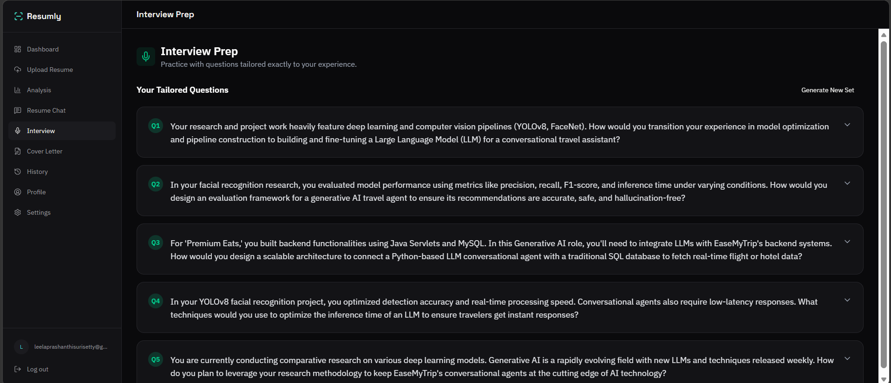
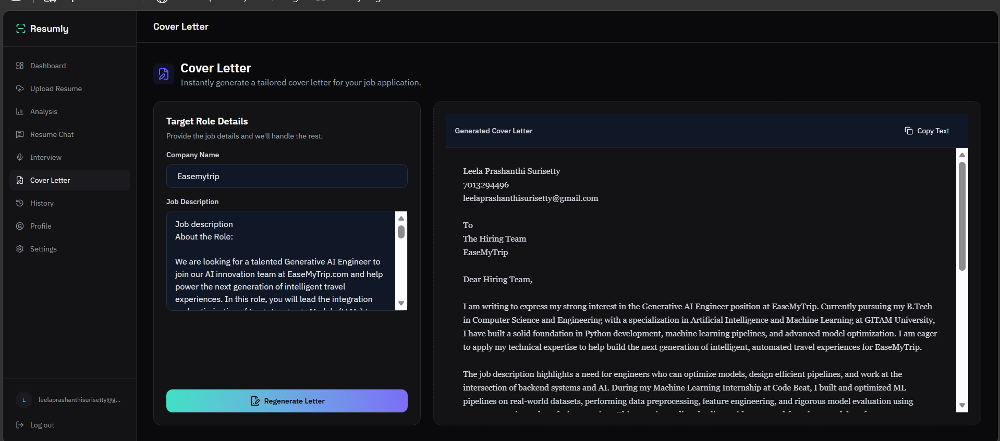

<div align="center">

# 🚀 Resumly - AI Resume Analyzer

### AI-powered Resume Analysis, ATS Scoring, Resume Chat, Interview Preparation & Cover Letter Generation

<p>
An intelligent resume analysis platform that evaluates resumes using Google Gemini AI, provides ATS compatibility scores, personalized improvement suggestions, AI-powered resume chat, interview preparation, and tailored cover letter generation.
</p>

<br>

[]()
[]()
[]()
[]()
[]()
[]()
[]()
[]()

</div>

---

# 🌐 Live Demo

👉 **Live Website**

(https://ai-resume-analyzer-1n9o.vercel.app/)

---

# 📌 Features

✅ Secure Firebase Authentication

✅ AI Resume Analysis

✅ ATS Compatibility Score

✅ Resume Improvement Suggestions

✅ Missing & Matched Skills Detection

✅ AI Resume Chat Assistant

✅ Personalized Interview Questions

✅ AI Cover Letter Generator

✅ Resume Upload (PDF/DOCX)

✅ Analysis History

✅ Modern Dashboard

---

# 🖼️ Application Preview

## Landing Page



---

## Login



---

## Dashboard



---

## Resume Upload



---

## ATS Analysis



---

## Resume Chat


---

## Interview Preparation



---

## AI Cover Letter



---

# ⚙️ Tech Stack

## Frontend

- React
- Vite
- React Router
- Context API
- CSS

## Backend

- FastAPI
- Python
- SQLite

## AI

- Google Gemini API

## Authentication

- Firebase Authentication

## Deployment

- Vercel

---

# 🧠 How It Works

```text
                User
                  │
                  ▼
          Upload Resume
                  │
                  ▼
         Resume Parser (FastAPI)
                  │
                  ▼
         Google Gemini AI
                  │
     ┌────────────┼─────────────┐
     ▼            ▼             ▼
 ATS Score   AI Feedback   Missing Skills
                  │
                  ▼
        Dashboard Visualization
                  │
      ┌───────────┼────────────┐
      ▼           ▼            ▼
 Resume Chat Interview Prep Cover Letter
```

---

# 📂 Project Structure

```text
AI-Resume-Analyzer
│
├── frontend
│   ├── src
│   ├── public
│   ├── package.json
│   └── vite.config.js
│
├── backend
│   ├── app
│   ├── tests
│   ├── uploaded_resumes
│   ├── requirements.txt
│   └── resume_analyzer.db
│
└── README.md
```

---

# 🚀 Getting Started

## Clone Repository

```bash
git clone https://github.com/LeelaSurisetty12/AI-Resume-Analyzer.git
```

---

## Frontend

```bash
cd frontend

npm install

npm run dev
```

---

## Backend

```bash
cd backend

pip install -r requirements.txt

uvicorn app.main:app --reload
```

---

# 🔑 Environment Variables

## Frontend (.env)

```env
VITE_FIREBASE_API_KEY=
VITE_FIREBASE_AUTH_DOMAIN=
VITE_FIREBASE_PROJECT_ID=
VITE_FIREBASE_STORAGE_BUCKET=
VITE_FIREBASE_MESSAGING_SENDER_ID=
VITE_FIREBASE_APP_ID=
```

---

## Backend (.env)

```env
GEMINI_API_KEY=YOUR_GEMINI_API_KEY
```

---

# 🎯 Future Improvements

- PDF Report Download
- Resume Version Comparison
- Multi-language Resume Support
- Recruiter Dashboard
- Company-specific ATS Optimization
- AI Resume Templates
- Job Recommendation Engine

---

# 👩‍💻 Author

### Leela Prashanthi Surisetty

B.Tech CSE (AI & ML)

GitHub

https://github.com/LeelaSurisetty12

LinkedIn

(Add your LinkedIn URL)

---

# ⭐ Support

If you found this project useful, consider giving it a ⭐ on GitHub.

It helps others discover the project and motivates future improvements.

---

<div align="center">

### Built using React, FastAPI, Firebase & Google Gemini AI

</div>
